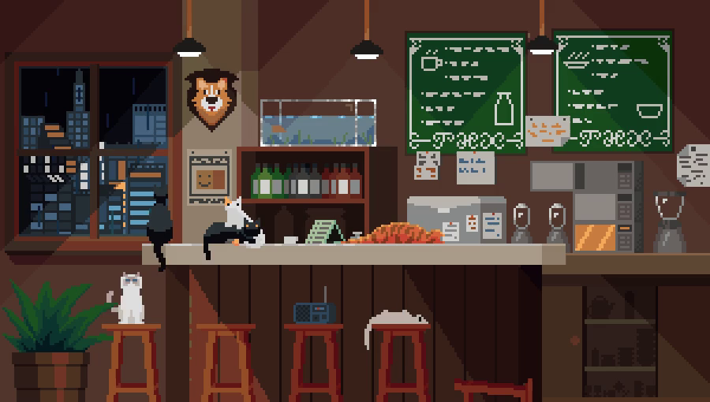
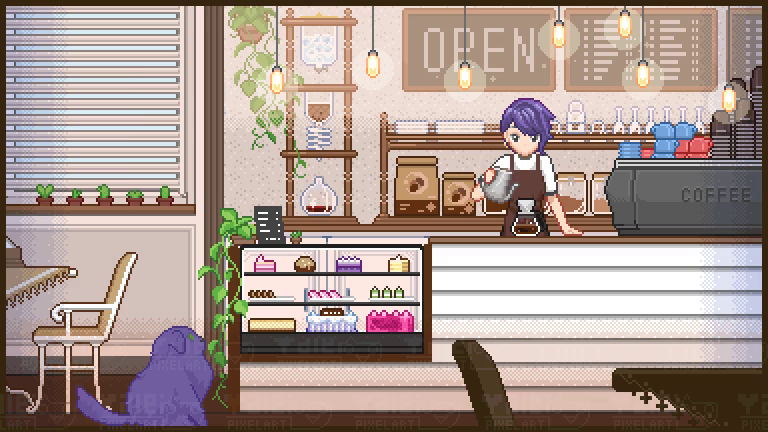
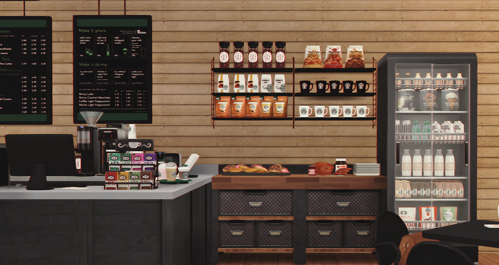

# WebGLWorks
Works I make in WebGL

# Mongoose
Download [executable](https://mongoose.ws/binary/) and follow instructions to setup webserer to avoid CORS in the directory you want to run (e.g. `./pilk`)

# Pilk
Description:
- Just playing around with pixi.js.
Requirements:
- Toradora OP expanding circle animation on click
- neco arc walking around
- interactable buttons that are "pressed down" when neco arc steps on them

# (Pilk) Cafe:
Description:
- Neco Arc (and I) have started to run a pilk cafe
Requirements:
- Click on a seats to enter and bring up the menu
- Neco Arc dialogue box with selectable menu items (it's just pilk)
- Mobile accessible view and menu
- Vaporwave vibe

### Credits, Pixel Art & Inspirations

- neco arc sprites : Ripped by Yvette#2060/Icy Mitsuhashi#1870. Previews made by !HisoNoKami!#9665 from the melty blood discord (Melty Blood Type Lumina)
- neco arc jordans background : https://twitter.com/AXMdoes/status/1433899842661752838?s=20
- (inspiration) neco arc fadeaway animation : https://youtu.be/VcIo6qEayBg 
-  by [u/khuevohuu2903](https://www.reddit.com/r/PixelArt/comments/viwbk5/coffee_shop/?utm_source=share&utm_medium=web2x&context=3)
-  by [@YaleiSyu](https://twitter.com/YaleiSyu) taking commissions
-  [DDAENG SIMS Starbucks Coffee Shop V2 (Furnished) ](https://ddaengsims.blogspot.com/2017/08/starbucks-coffee-shop-v2-furnished.html?m=1)
- [QuartzStash](https://www.deviantart.com/quartzstash/shop/commissions) pixel art artist who is taking commissions